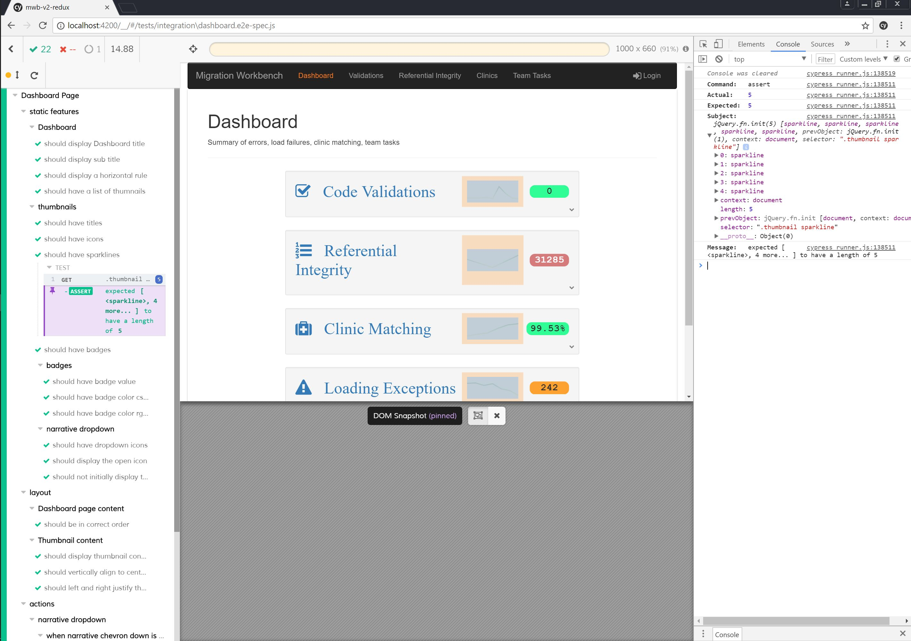

# Cypress e2e testing

The Cypress testing framework is more user friendly than the Protractor/Karma/Selenium tools provided with Angular.



## Why Cypress

- Features assisting failure correction
  - Gui-based, easier to read and track error messages
  - Error information expands into chrome dev console on click
  - Steps (commands) within tests are enumerated, makes point of failure more obvious
- Commands = implicit assertions + retry
  - Selector commands contain built-in assertions
  - Saves boiler-plate expects
  - Auto-retry of commands until success or timeout
- Observe test execution
  - Real-time view of tested page with highlight of selected elements
  - Snapshot of page at each command, allows time-travel review of page at each step
  - Before and after snapshots on user actions (e.g clicks)
- Async commands wait (mostly) for the page to settle
- Wide range of built-in commands
- Easily implement user-defined commands and test helpers

## Waiting for the page

### The problem with waiting

If a web page fetches data asynchronously, a delay will occur before complete rendering. In a Selenium e2e test, we add a wait to handle this.  
However the load time can vary depending on workstation and network load, so a maximum wait period needs to be set - but even then a test can exceed this period, and the test sporadically fails.

### Retry until success

Cypress commands have a built-in retry mechanism. This pattern of waiting is better than an explicit wait period, as it will succeed as soon as the fetch completes. As long as the timeout is sufficiently long (default is 5s) tests should not sporadically fail due to loading.

The key to implementing this type of page load is to pick a 'canary' element, one that has it's content set last and test for that particular content, e.g below we wait for the page to contain the text **'99.53%'**

```javascript
const load_page = () => {
  cy.viewport((3000/1.5), (2000/1.5))
  cy.visit('/')
  // wait for the last metric to get calculated text
  cy.contains('99.53%', {timeout: 10000})  
}
```

## Test suite structure

A page is tested in three sections - Static, Layout, and Actions.

### Static tests

These tests check the static look of the page after it first loads, i.e which elements are present, what are their attributes.

They do not change the view, so only one page load (implemented in a `before()` command) is required for all of them, allowing these tests to proceed much faster.

Depending on the nature of the page, this can be the bulk of the tests.

```javascript
describe('Dashboard Page', () => {

  before(function(){
    cy.visit('/')
    cy.contains('99.53%', {timeout: 10000})  
  })

  context('static features', function(){
    context('Dashboard', function(){
      it('should display Dashboard title', () => {
        cy.get('.dashboard>h1').should('contain', 'Dashboard')
      });
      ...
```

### Layout tests

Layout tests attempt to do in code what the eye does automatically - check the element layout looks correct.

These tests generally do not use exact measurements, as this would make the brittle. Instead it uses higher-order concepts such as element ordering, alignment, and justification.

```javascript
context('layout', () => {

  beforeEach(function () {
    cy.viewport((3000/1.5), (2000/1.5))
  })

  describe('Thumbnail content', () => {

    const selectors = ['.measure-icon','.title', '.filler', 'sparkline', '.badge']

    it('should display thumbnail contents in order', () => {
      cy.get('.thumbnail').each(el => {
        cy.wrap(el).selectorsAreOrdered(selectors)
      })
    })

    it('should vertically align to center the thumbnail contents', () => {
      cy.get('.thumbnail').each(el => {
        cy.wrap(el).find(selectors.join(', '))
          .then(children => {
            const sortedSelectors = [...children].map(el => getSelector(el, selectors))
            const vcs = [...children].map(child => elementVerticalCenter(child))
            expect(areAligned(vcs)).to.be.true
          })
      })
    })
```

### Action tests

These test user actions on the page, e.g clicks, selects, inputs. They will require a fresh page load between tests, so run slower than the static tests. (Note the `cy.wait()` does not have to be as long as the initial page load, since the files have not changed and fetch will return a network status of 304 - Not modified).

```javascript
context('actions', () => {

  describe('thumbnail navigation', () => {

    beforeEach(() => {
      cy.visit('/')
      cy.contains('99.53%', {timeout: 10000})  
    })

    ['validations', 'referentials', 'clinics'].forEach((page, index) => {

      it(`should navigate to '${page}'`, () => {
        cy.get('.thumbnail a.measure').eq(index).click()
        cy.location().should((loc) => {
          expect(loc.href).to.eq(`http://localhost:4200/${page}`)
        })
      });

    })
  });
```
